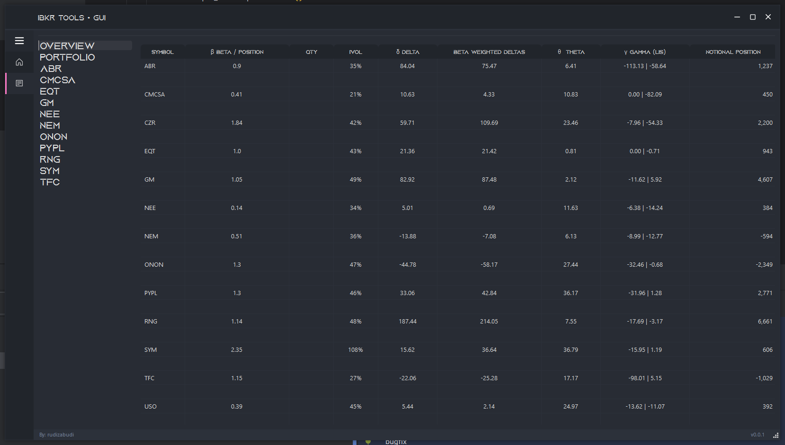

# IBKR Positions Dashboard GUI
Displays consolidated positions and greeks for your single account portfolio. Connects to Trader Workstation / IB Gateway API.
## Example
### GUI

## Settings
### Customization
### TWS API

## Setup
uv sync
## Start
uv run main.py
